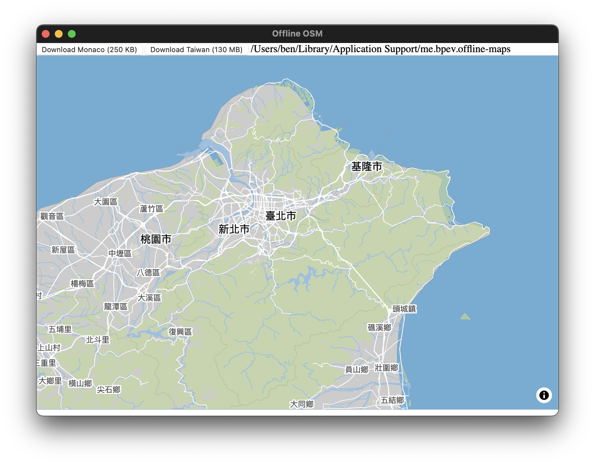

# Tauri Offline Maps

This is a proof-of-concept for building offline maps with Tauri, maplibregl, and protomaps.

This is meant to prove the dataflow for building something like Organic Maps:

- A world basemap is downloaded on app load/install
- User can download regional maps via the app
- Downloaded maps are displayed offline, and overlay the world basemap



## Technologies for App

- **[tauri](https://tauri.app)**: I'm building apps with Tauri right now, so this is the tech I wanted to test
- **[pmtiles](https://protomaps.github.io)**: I settled on pmtiles because the ability to run maplibregl directly from static files simplifies the process on the client
- **[maplibregl](https://maplibre.org)**: a powerful solution that has a defined happy path with pmtiles
- **[deno](https://deno.com)**: I'm just using this for my build system for my other projects, so used it here for my convenience. Could probably make it work in vanilla or a node build system without too much effort.

### Technologies for Tile Creation

- **[geofabrik](https://download.geofabrik.de)**: I don't really want to deal with defining regions, so geofabrik seems like a natural choice; I can use their `oms.pbf` and `.poly` files to help define my download regions in the future
- [**NaturalEarthData**](https://www.naturalearthdata.com): Very fast way to create planet-scale basemaps. I think for greater control, however, I might prefer to build directly from planet.osm for a full product.
- [**ogr2ogr**](https://gdal.org/en/stable/programs/ogr2ogr.html): Basically used just as a way to move from Natural Earth Data to data consumable by tippecanoe
- [**tippecanoe**](https://github.com/felt/tippecanoe): Their docs are [basically the process I used](https://github.com/felt/tippecanoe?tab=readme-ov-file#show-countries-at-low-zoom-levels-but-states-at-higher-zoom-levels) for the basemap tile creation, and I wish I found it way earlier, because it was a pain in the ass without it.
- [**tilemaker**](http://tilemaker.org): Fills similar space as tippecanoe. Seems like it might be easier to deal with filters using it. But using either one of this or tippecanoe would probably be good enough.

## Usage

The only prerequisite is to have [deno](https://deno.com) installed.

```sh
# install deno
curl -fsSL https://deno.land/install.sh | sh

# Run App
deno task dev
```

### Things you'd probably want to integrate if taking it further:

- More of an automated way of creating region tiles
- Scrolling on the map on some zoom levels will expose download links for viewable regions
  - Reading user position could also be used to dynamically load maps a user has already downloaded
- Report download progress
- Make sure that region tiles overlay basemap in such a way that the janky guesstimations aren't seen by the user
- The regions on geofabrik are quite heavy; might want to either trim the data, or make even more local maps available.

## Building the Regional Tiles

I generated the local regional tiles via:

- download `.osm.pbf` from geofabrik
- `tilemaker thailand-latest.osm.pbf thailand.pmtiles`, using `config-openmaptiles.json` and `process-openmaptiles.lua` (I cloned these into scripts/tilemaker)

## Building the Basemap Tiles

Download data the following data from https://www.naturalearthdata.com

- ne_10m_admin_0_boundary_lines_land
- ne_10m_admin_0_countries

```sh
# Convert the shp files into geojson
# note: you do need the other files to exist alongside the shp files
ogr2ogr -f GeoJSON boundaries.geojson ne_10m_admin_0_boundary_lines_land.shp
ogr2ogr -f GeoJSON countries.geojson ne_10m_admin_0_countries.shp

# process the geojson into mbtiles via tippecanoe
tippecanoe -Z4 -zg -o boundaries.mbtiles --coalesce-densest-as-needed --extend-zooms-if-still-dropping boundaries.geojson
tippecanoe -z3 -zg -o countries.mbtiles --coalesce-densest-as-needed countries.geojson

# Join together the tiles into world tiles
tile-join -o world.mbtiles countries.mbtiles boundaries.mbtiles

#Convert the world file into pmtiles
pmtiles convert world.mbtiles world.pmtiles
```


-------


rustup override set nightly

